# Laporan Praktikum Pemrograman Asynchronous

> Nama    : Syahla' Syafiqah Fayra
>
> NIM     : 2141720015
>
> Kelas   : TI - 3G
>
> Link Github : 

## Praktikum 1: Mengunduh Data dari Web Service (API)

### Langkah 1: Buat Project Baru
Buatlah sebuah project flutter baru dengan nama books di folder src week-12 repository GitHub Anda.

Kemudian Tambahkan dependensi http dengan mengetik perintah berikut di terminal.

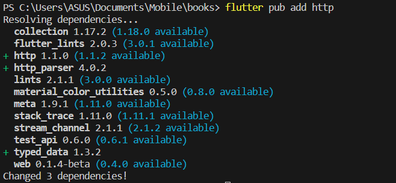

### Langkah 2: Cek file pubspec.yaml
Jika berhasil install plugin, pastikan plugin http telah ada di file pubspec ini seperti berikut.

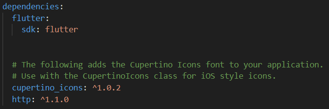

### Langkah 3: Buka file main.dart
> **Soal 1**
>
> * Tambahkan nama panggilan Anda pada title app sebagai identitas hasil pekerjaan Anda.
>
>   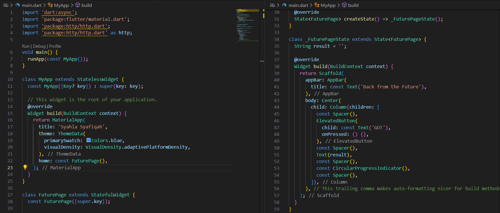

### Langkah 4: Tambah method getData()
Tambahkan method ini ke dalam class _FuturePageState yang berguna untuk mengambil data dari API Google Books.

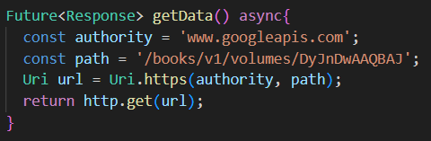

> **Soal 2**
>
> * Carilah judul buku favorit Anda di Google Books, lalu ganti ID buku pada variabel path di kode tersebut. Caranya ambil di URL browser Anda seperti gambar berikut ini.
> 
>   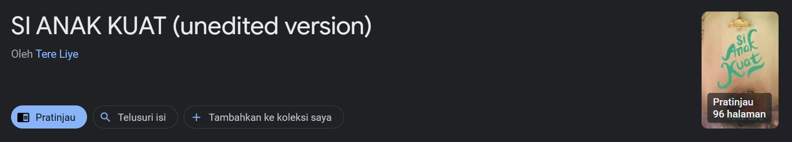
>
> * Kemudian cobalah akses di browser URI tersebut dengan lengkap seperti ini. Jika menampilkan data JSON, maka Anda telah berhasil. Lakukan capture milik Anda dan tulis di README pada laporan praktikum. Lalu lakukan commit dengan pesan "W12: Soal 2".
>
>   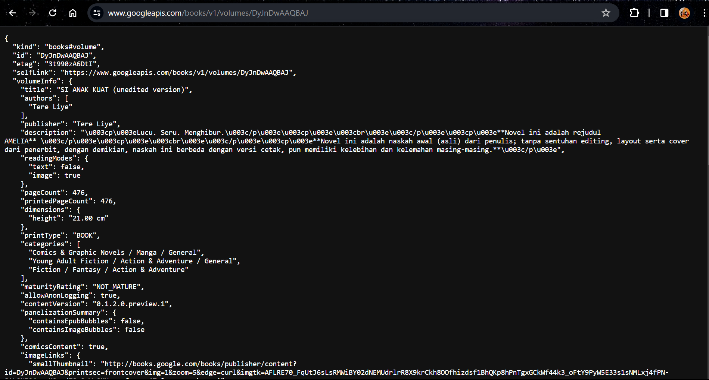

### Langkah 5: Tambah kode di ElevatedButton
Tambahkan kode pada onPressed di ElevatedButton seperti berikut.

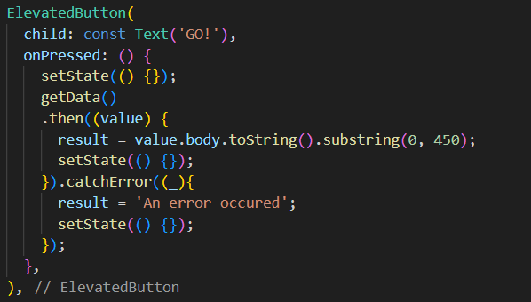

> **Soal 3**
>
> * Jelaskan maksud kode langkah 5 tersebut terkait substring dan catchError!
> 
>   Pada langkah kelima, dilakukan penggunaan metode substring(0, 450) untuk mengekstraksi 450 karakter pertama dari respons HTTP untuk membatasi panjang teks yang akan ditampilkan dalam aplikasi. Penggunaan catchErrordigunakan untuk mengatasi kemungkinan terjadinya kesalahan selama proses permintaan data. Jika terdapat kesalahan saat pengambilan data, maka  pesan 'An error has occurred' akan dimasukkan ke variabel result dan ditampilkan.
>
> * Capture hasil praktikum Anda berupa GIF dan lampirkan di README. Lalu lakukan commit dengan pesan "W12: Soal 3".
>
>   

## Praktikum 2: Menggunakan await/async untuk menghindari callbacks

### Langkah 1: Buka file main.dart
Tambahkan tiga method berisi kode seperti berikut di dalam class _FuturePageState.

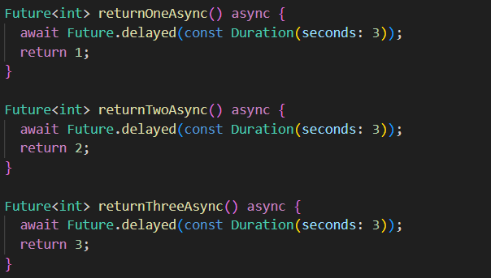

### Langkah 2: Tambah method count()
Lalu tambahkan lagi method ini di bawah ketiga method sebelumnya.

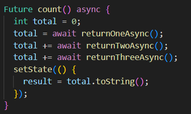

### Langkah 3: Panggil count()
Lakukan comment kode sebelumnya, ubah isi kode onPressed() menjadi seperti berikut.

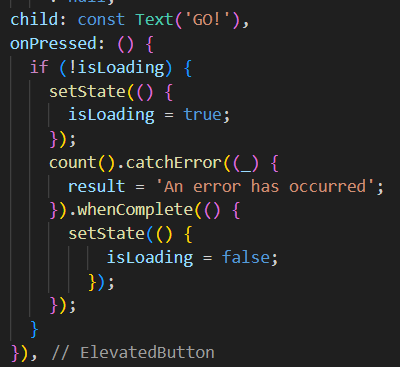

### Langkah 4: Run
Akhirnya, run atau tekan F5 jika aplikasi belum running. Maka Anda akan melihat seperti gambar berikut, hasil angka 6 akan tampil setelah delay 9 detik.

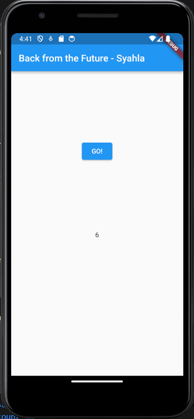

> **Soal 4**
>
> * Jelaskan maksud kode langkah 1 dan 2 tersebut!
>
>      Langkah 1: Di dalam file main.dart, kita menambahkan tiga metode baru di dalam class _FuturePageState. Metode-metode tersebut adalah returnOneAsync, returnTwoAsync, dan returnThreeAsync. Metode-metode ini mensimulasikan operasi asynchronous dengan menunggu selama 3 detik. Setelah 3 detik, metode-metode ini akan mengembalikan nilai integer.
>
>      Langkah 2: Metode count() menunggu ketiga operasi tersebut selesai. Ketika ketiga operasi tersebut selesai, metode count() akan melakukan sesuatu, seperti mengubah tampilan widget.
>
> * Capture hasil praktikum Anda berupa GIF dan lampirkan di README. Lalu lakukan commit dengan pesan "W12: Soal 4".
> 
>   

## Praktikum 3: Menggunakan Completer di Future

### Langkah 1: Buka main.dart
Pastikan telah impor package async berikut.

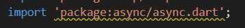

### Langkah 2: Tambahkan variabel dan method
Tambahkan variabel late dan method di class _FuturePageState seperti ini.

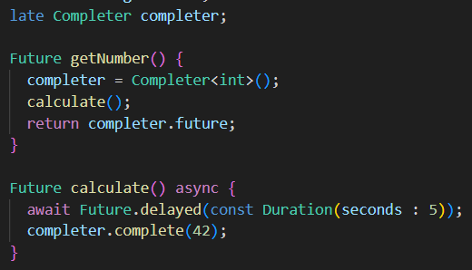

### Langkah 3: Ganti isi kode onPressed()
Tambahkan kode berikut pada fungsi onPressed(). Kode sebelumnya bisa Anda comment.

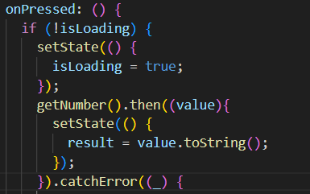

### Langkah 4: Run
Terakhir, run atau tekan F5 untuk melihat hasilnya jika memang belum running. Bisa juga lakukan hot restart jika aplikasi sudah running. Maka hasilnya akan seperti gambar berikut ini. Setelah 5 detik, maka angka 42 akan tampil.

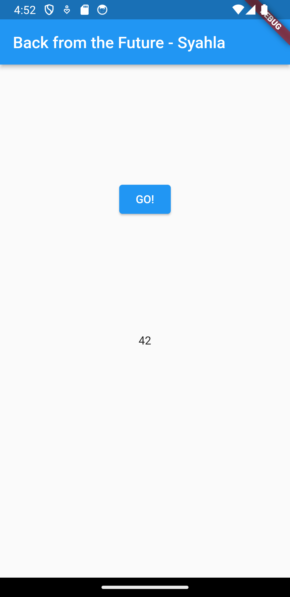

> **Soal 5**
>
> * Jelaskan maksud kode langkah 2 tersebut!
>
>   Langkah 2 mendefinisikan variabel completer dan dua metode, yaitu getNumber() dan calculate(), dalam class _FuturePageState. completer digunakan sebagai objek Completer, yang memungkinkan pembuatan nilai Future secara manual. Metode getNumber() menginisialisasi completer, memanggil metode calculate() yang mensimulasikan operasi yang memakan waktu, dan mengembalikan completer.future. Dengan ini, saat operasi selesai, completer.complete(42) dipanggil, dan nilai 42 dapat diakses melalui completer.future. Langkah-langkah tersebut menciptakan mekanisme untuk menghasilkan nilai asinkron setelah suatu operasi selesai, dan Completer digunakan untuk mengelola alur eksekusi dan nilai Future.
> * Capture hasil praktikum Anda berupa GIF dan lampirkan di README. Lalu lakukan commit dengan pesan "W12: Soal 5".
>
>   

### Langkah 5: Ganti method calculate()
Gantilah isi code method calculate() seperti kode berikut, atau Anda dapat membuat calculate2()

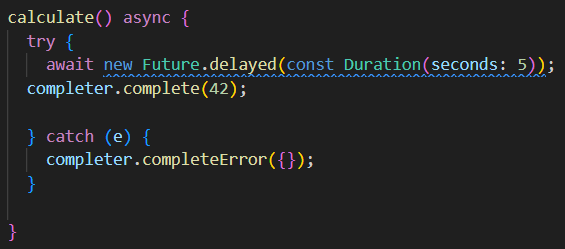

### Langkah 6: Pindah ke onPressed()
Ganti menjadi kode seperti berikut.

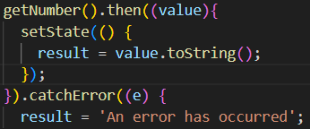

> **Soal 6**
>
> * Jelaskan maksud perbedaan kode langkah 2 dengan langkah 5-6 tersebut!
>
>   Langkah 2, 5, dan 6 berkaitan dengan penanganan operasi asinkron menggunakan Completer dan Future dalam konteks Flutter. Pada Langkah 2 memperkenalkan variabel completer dan dua metode, getNumber() dan calculate(), yang bekerja bersama untuk menghasilkan nilai asinkron. Pada Langkah 5 menggantikan isi metode calculate() dengan penanganan error yang lebih rinci, memungkinkan program untuk menangani dan mengatasi kesalahan yang mungkin terjadi selama eksekusi operasi. dan Pada Langkah 6 memperbarui bagian onPressed() untuk memanfaatkan hasil dari operasi asinkron, menggunakan .then() untuk menangkap nilai ketika operasi selesai dan .catchError() untuk menangani kesalahan
> * Capture hasil praktikum Anda berupa GIF dan lampirkan di README. Lalu lakukan commit dengan pesan "W12: Soal 6".
> 
>   

## Praktikum 4: Memanggil Future secara paralel

### Langkah 1: Buka file main.dart
Tambahkan method ini ke dalam class _FuturePageState

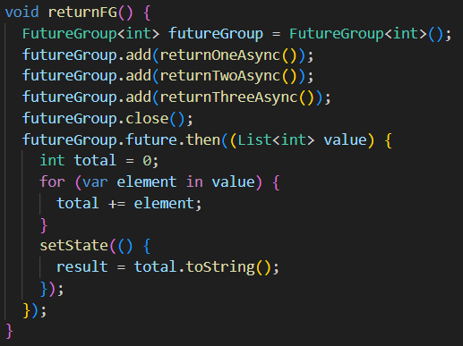

### Langkah 2: Edit onPressed()
Anda bisa hapus atau comment kode sebelumnya, kemudian panggil method dari langkah 1 tersebut.

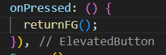

### Langkah 3: Run
Anda akan melihat hasilnya dalam 3 detik berupa angka 6 lebih cepat dibandingkan praktikum sebelumnya menunggu sampai 9 detik.

> **Soal 7**
>
> * Capture hasil praktikum Anda berupa GIF dan lampirkan di README. Lalu lakukan commit dengan pesan "W12: Soal 7".
>
>   

### Langkah 4: Ganti variabel futureGroup
Anda dapat menggunakan FutureGroup dengan Future.wait seperti kode berikut.

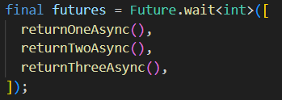

> **Soal 8**
>
> * Jelaskan maksud perbedaan kode langkah 1 dan 4!
>
>   Langkah 1: Di dalam langkah ini, kita membuat grup dari tiga operasi yang memakan waktu lama. Ketika grup tersebut selesai, kita menjumlahkan hasil dari operasi-operasi tersebut dan memperbarui tampilan widget.
>
>   Langkah 4: Di dalam langkah ini, kita menunggu sampai tiga operasi yang memakan waktu lama selesai. Ketika ketiga operasi tersebut selesai, kita mengumpulkan hasil dari operasi-operasi tersebut dan memperbarui tampilan widget.

## Praktikum 5: Menangani Respon Error pada Async Code

### Langkah 1: Buka file main.dart
Tambahkan method ini ke dalam class _FuturePageState

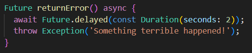

### Langkah 2: ElevatedButton
Ganti dengan kode berikut

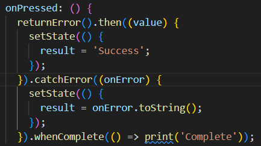

### Langkah 3: Run
Lakukan run dan klik tombol GO! maka akan menghasilkan seperti gambar berikut.

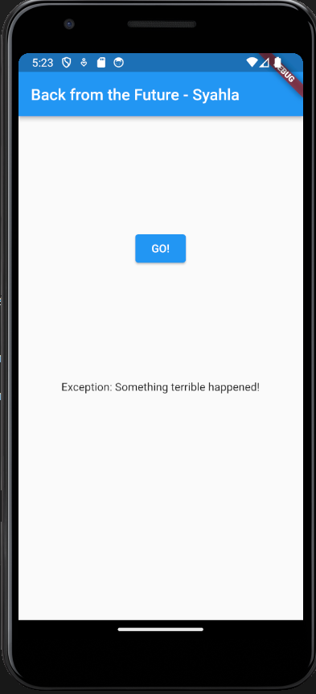

Pada bagian debug console akan melihat teks Complete seperti berikut.

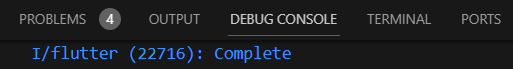

> **Soal 9**
>
> * Capture hasil praktikum Anda berupa GIF dan lampirkan di README. Lalu lakukan commit dengan pesan "W12: Soal 9".
>
>   

### Langkah 4: Tambah method handleError()
Tambahkan kode ini di dalam class _FutureStatePage

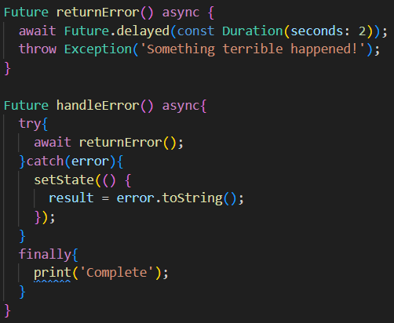

> **Soal 10**
>
> * Panggil method handleError() tersebut di ElevatedButton, lalu run. Apa hasilnya? Jelaskan perbedaan kode langkah 1 dan 4!
>
>   <table>
>    <tr>
>    <th>Panggil method handleError</th>
>    <th>Hasil Run</th>
>    </tr>
>    <tr>
>    <th></th>
>    <th></th>
>    </tr>
>   </table>

>
>   Metode returnError() berfungsi untuk menyimulasikan kondisi kesalahan. Metode ini akan menunggu selama 2 detik, lalu memicu kesalahan dengan kode kesalahan 404.
>   Metode handleError() berfungsi untuk menangani kesalahan yang mungkin terjadi. Metode ini akan mencoba mengeksekusi metode returnError(), dan jika metode tersebut menghasilkan kesalahan, maka kesalahan tersebut akan ditangkap dan ditampilkan di tampilan widget.

## Praktikum 6: Menggunakan Future dengan StatefulWidget

### Langkah 1: install plugin geolocator
Tambahkan plugin geolocator dengan mengetik perintah berikut di terminal.

### Langkah 2: Tambah permission GPS
Jika Anda menargetkan untuk platform Android, maka tambahkan baris kode berikut di file android/app/src/main/androidmanifest.xml

### Langkah 3: Buat file geolocation.dart
Tambahkan file baru ini di folder lib project Anda.

### Langkah 4: Buat StatefulWidget
Buat class LocationScreen di dalam file geolocation.dart

### Langkah 5: Isi kode geolocation.dart

> **Soal 11**
>
> * Tambahkan nama panggilan Anda pada tiap properti title sebagai identitas pekerjaan Anda.

### Langkah 6: Edit main.dart
Panggil screen baru tersebut di file main Anda seperti berikut.

### Langkah 7: Run
Run project Anda di device atau emulator (bukan browser), maka akan tampil seperti berikut ini.

### Langkah 8: Tambahkan animasi loading
Tambahkan widget loading seperti kode berikut. Lalu hot restart, perhatikan perubahannya.

> **Soal 12**
>
> * Jika Anda tidak melihat animasi loading tampil, kemungkinan itu berjalan sangat cepat. Tambahkan delay pada method getPosition() dengan kode await Future.delayed(const Duration(seconds: 3));
>
> * Apakah Anda mendapatkan koordinat GPS ketika run di browser? Mengapa demikian?
>
> * Capture hasil praktikum Anda berupa GIF dan lampirkan di README. Lalu lakukan commit dengan pesan "W12: Soal 12".

## Praktikum 7: Manajemen Future dengan FutureBuilder

### Langkah 1: Modifikasi method getPosition()
Buka file geolocation.dart kemudian ganti isi method dengan kode ini.

### Langkah 2: Tambah variabel
Tambah variabel ini di class _LocationScreenState

### Langkah 3: Tambah initState()
Tambah method ini dan set variabel position

### Langkah 4: Edit method build()
Ketik kode berikut dan sesuaikan. Kode lama bisa Anda comment atau hapus.

> **Soal 13**
>
> * Apakah ada perbedaan UI dengan praktikum sebelumnya? Mengapa demikian?
> 
> * Capture hasil praktikum Anda berupa GIF dan lampirkan di README. Lalu lakukan commit dengan pesan "W12: Soal 13".
> 
> * Seperti yang Anda lihat, menggunakan FutureBuilder lebih efisien, clean, dan reactive dengan Future bersama UI.

### Langkah 5: Tambah handling error
Tambahkan kode berikut untuk menangani ketika terjadi error. Kemudian hot restart.

> **Soal 14**
>
> * Apakah ada perbedaan UI dengan langkah sebelumnya? Mengapa demikian?
>
> * Capture hasil praktikum Anda berupa GIF dan lampirkan di README. Lalu lakukan commit dengan pesan "W12: Soal 14".

## Praktikum 8: Navigation route dengan Future Function

### Langkah 1: Buat file baru navigation_first.dart
Buatlah file baru ini di project lib Anda.

### Langkah 2: Isi kode navigation_first.dart

> **Soal 15**
> 
> * Tambahkan nama panggilan Anda pada tiap properti title sebagai identitas pekerjaan Anda.
>
> * Silakan ganti dengan warna tema favorit Anda.

### Langkah 3: Tambah method di class _NavigationFirstState
Tambahkan method ini.

### Langkah 4: Buat file baru navigation_second.dart
Buat file baru ini di project lib Anda. Silakan jika ingin mengelompokkan view menjadi satu folder dan sesuaikan impor yang dibutuhkan.

### Langkah 5: Buat class NavigationSecond dengan StatefulWidget

### Langkah 6: Edit main.dart
Lakukan edit properti home.

### Langkah 7: Run
Lakukan run, jika terjadi error silakan diperbaiki.

> **Soal 16**
> 
> * Cobalah klik setiap button, apa yang terjadi ? Mengapa demikian ?
>
> * Gantilah 3 warna pada langkah 5 dengan warna favorit Anda!
>
> * Capture hasil praktikum Anda berupa GIF dan lampirkan di README. Lalu lakukan commit dengan pesan "W12: Soal 16".

## Praktikum 9: Memanfaatkan async/await dengan Widget Dialog

### Langkah 1: Buat file baru navigation_dialog.dart
Buat file dart baru di folder lib project Anda.

### Langkah 2: Isi kode navigation_dialog.dart

### Langkah 3: Tambah method async

### Langkah 4: Panggil method di ElevatedButton

### Langkah 5: Edit main.dart
Ubah properti home

### Langkah 6: Run
Coba ganti warna background dengan widget dialog tersebut. Jika terjadi error, silakan diperbaiki. Jika berhasil, akan tampil seperti gambar berikut.

> **Soal 17**
>
> * Cobalah klik setiap button, apa yang terjadi ? Mengapa demikian ?
>
> * Gantilah 3 warna pada langkah 3 dengan warna favorit Anda!
>
> * Capture hasil praktikum Anda berupa GIF dan lampirkan di README. Lalu lakukan commit dengan pesan "W12: Soal 17".
